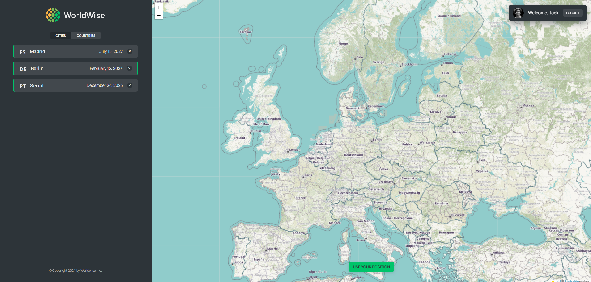

This is a project that is taught by [Jonas Schmedtmann](https://github.com/jonasschmedtmann) in his awesome [Course](https://www.udemy.com/course/the-ultimate-react-course/?couponCode=ST13MT40224)

in this project, I learned:

- how to use **react-router** and it's **custom hooks**
- how to use **lazy loading** for better performance
- how to create **ProtectedRoute**
- how to use **ContextApi** and **reducers**
- how to create and use **custom hooks**
- how to use **Suspense** component

